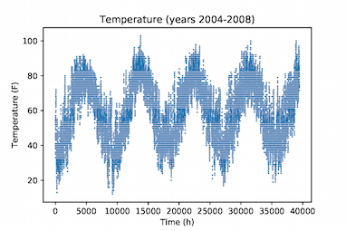
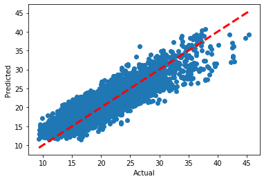

# Multiple linear regression with interaction effects for load forecasting

**Authors**: Ana Jevtic and Stefanos Baros (both authors contributed equally)

## Project description

Electric load forecasting lies at the heart of  power  system  operation  routines  such  as  economic  dispatch and optimal power flow. In recent years the scientific community has placed a lot of emphasis towards  developing  accurate  models for  predicting  electric  load.  Prior  art  in  this domain employed time-series and linear regression for developing good  forecasting  models.  In this project, we use **multiple polynomial regression with interaction effects and cyclical features encoding** to develop a new model that can accurately predict electric load from several features including the temperature.  We  test and quantify  their  performance of our full model together with various reduced-order models that rely on subsets of all features via both standard  **goodness-of-fit-criteria** such as the adjusted R-squared as well as criteria that rely on the **prediction error**. 

## Dataset description

The dataset used in this project originates from the [Global Energy Forecasting Competition 2012](https://www.kaggle.com/c/global-energy-forecasting-competition-2012-load-forecasting/overview/description) - a hierarchical load forecasting problem for forecasting hourly loads (in kW) for a US utility with 20 zones.

Data (loads of 20 zones and temperature of 11 stations) history ranges from the 1st hour of 2004/1/1 to the 6th hour of 2008/6/30. Given actual temperature history, 8 nonconsecutive weeks in the load history are set to be missing.

In both of the original dataset files three columns are calendar variables: year, month of the year and day of the month, and the last 24 columns are the 24 hours of the day. Files:
- `Load_history.csv` - first column is load zone ID
- `Temperature_history.csv` - first column is temperature station ID

Additionally, a file containing a list of holidays, `Holiday_list.csv`, for the period 2004-2008 is used.

## Description of files

There are **four** main files in this project repository:

- `dataPrep.py`
- `DataAnalysis.py`
- `Load_forecasting.py`

The `DataAnalysis.py` contains code for imputation of missing data and correlation analysis for load zones and temperature stations. The `Load_history.csv` is missing 8 nonconsecutive weeks of load data. Missing hourly load values were imputed using the mean value of the same load zone at the same time (hour, day, month) over the other available years. The correlation analysis showed that there is a strong correlation, for example, between load in load zone 1 and temperature measured by temperature station 6 (corr_coeff ~ 0.85). It is therefore likely that the load zone 1 and temperature station 6 are geograpically collocated.

The `dataPrep.py` contains code for data cleansing and preprocessing for regression. Various features (described below), including main effects and interaction effects, are generated and added to the datatable `full_model.csv`

The `Load_forecasting.py` file contains the implementation of the various Multiple Linear Regression (MLR) models described below.

## Project details

### Load-temperature characteristic

From the two figures below, one can see that there is high correlation between the peaks and valleys of the temperature and the electric load. This  aligns  well  with  intuition  and  corroborates  the  causal relationship  between  temperature  and  load  that  is,  high  and low  temperature  are  the  main  drivers  behind  the electric load  peaks. The  load can thus be forecasted through  its  relationship  with temperature. 

    

Using  the  data,  we  plot  the  load  versus  temperature  characteristic to get a sense of its overall shape. 

  

We  see  that,  this  characteristic  has a  predominantly  quadratic/cubic  U-shape.  We  note  that,  this curve  is  not symmetric  as  its right  part  exhibits  steeper  slope  than  the  left  part.  The minimum  of  this curve  appears to be around 62  F.  Given  the  shape of this curve one can easily conclude that piecewise linear, piecewise quadratic, continuous quadratic or cubic functions seem to be the most appropriate functions for capturing the basic relationship between the load and temperature. In this project, we explore both a continuous  **quadratic  function** and a **cubic function** to  model  the  load-temperature  relationship. 

### Capturing seasonal variations in load-temperature characteristic via interaction effects
Having established the main form of the load-temperature characteristic, we now explore how the particular month of the year, day of the week, and hour of the day affect the load either directly via energy-demanding human activities or indirectly via changes in the load-temperature relationship.

#### Effect of month of the year on electric load
Summer months are characterized by high temperatures while winter months by low temperatures. Therefore each different month of the year contributes to a different part of the load-temperature characteristic. The months between May and September contribute to the right part while the months between December and March to the left part and the rest of the months to the bottom part. Now, the critical question is:

- *Can the same load-temperature characteristic be used to capture the relationship between temperature and load in different months?*

To gain more insight, we study the load-temperature characteristic for several months of the year. We conclude that, the quantitative relationship between the temperature and the load varies along with each month. This simply means that same temperature will lead to different electric load levels in different months. A few days with high temperatures in May will not lead to the same load as days with the same temperatures in August as people would probably not turn on AC in May even if the temperature in some days is high. Similarly, a few cold days in September will not result in the same load as days with the same temperature in October as a lot of central heating systems are usually scheduled to turn on in October.
It it clear from this analysis that the **load-temperature characteristic for different months has to be different**. In particular, the function that describes the relationship between the load and the temperature depends on the month under consideration. In regression analysis, such effects can be formally accounted for in a model through interaction effects. Here, we consider **interaction effects among the temperature-load  characteristic and each month** in our model via new features.

#### Effect of day of the week on the electric load
The load-temperature characteristic does not depend on the particular day of the week e.g., the same temperature during the week should lead to approximately the same Load in a weekday and the weekends, assuming that everything else remains equal. There is no reason for people to react to a particular temperature differently during a weekday than in the weekend. Further, there is not reason for the temperatures during the week to be different than the temperatures during the weekend. Nevertheless, the load on the weekdays would be different than the load on the weekend primarily due to people engaging in different activities on the weekends than on weekdays that may demand different energy levels.

#### Effect of hour of the day on the load
The temperature varies with the hour of the day. We want to see whether the load-temperature characteristic depends on the hour of the day. Plotting the load for different hours of the day, we see that the load-temperature characteristic does change with the hour of the day. This aligns well with intuition as low temperature in the middle of the night will not lead to the same electric load as the same temperature at noon the day after--- as people most likely will not wake up and turn on heat in the middle of the night. 
To account for this effect, we allow **interaction of the load-temperature characteristic with the hour of the day** via additional features.
The hour of the day also affects the load through the heat build-up effect. The temperature at the previous hour will affect the load at the current hour together with the temperature at the current hour. To understanding this,  consider the following two scenarios. In the first scenario,  consider a winter day where the temperature at the previous hour is higher than the temperature at the current hour. In this case, the buildings' walls would have stored some heat and thus there is not need for people to ramp up their heating systems at the current hour. In the second scenario,  consider that the temperature in the previous hour is the same with the temperature at the current hour (and equal to the temperature at the current hour of the previous scenario). In this case there is not much heat build-up in the buildings so at the current hour people would have to use their heating systems more heavily despite having the same temperature as in the previous scenario.

### Encoding continuous cyclical variables

Variables such as month of the year (1-12), day of the month (1-28 to 31), hour of the day (0-24) are inherently cyclical. The need for encoding these variable comes, for example, from the fact that month 1 (January) is not necesarily 11 months away from month 12 (December). This means that keeping the ordinal encodings for these variables produces an unwanted bias in any Machine Learning algorithm: that January and December are really far away. To remove this bias, these variables are usually considered categorical and encoded as one-hot vectors (dummy variables). However, this encoding removes the inherent ordering of the variables: months come in a specific order, and January and December are just as close to each other as June and July. In order to preserve this information on inherent ordering of cyclical variables, we encode each of the cyclical features using two additional variables: sine and cosine transforms. 

Example below shows the cyclical variable encoding of the hour of the day. Using this encoding 23:00 is just as close to 1:00, as 15:00 is to 17:00, which is exactly the information we wanted preserved.

## Results

The **features** used to construct a regression model are:

- `features =['TREND','TMP','TMP2','TMP3','SIN_MONTH','COS_MONTH','TMPxSIN_MONTH',`
            `'TMPxCOS_MONTH','TMP2xSIN_MONTH','TMP2xCOS_MONTH', 'TMP3xSIN_MONTH','TMP3xCOS_MONTH',`
           ` 'TMPxSIN_HOUR','TMPxCOS_HOUR','TMP2xSIN_HOUR','TMP2xCOS_HOUR', 'TMP3xSIN_HOUR','TMP3xCOS_HOUR',`
           ` 'DTMPxSIN_HOUR', 'DTMPxCOS_HOUR', 'Holi','isWknd']`
            
where, TMP, TMP2 and TMP3 denote the temperature, temperature squared and temperature in the cubic power, respectively. The features SIN_MONTH, COS_MONTH, SIN_HOUR, COS_HOUR denote the cyclical variables associated with the particular month of the year and hour of the day. 

We construct **seven regression models** including the full model, each time considering a different **subset of features**:

- `Model 1= ['TREND','TMP','TMP2']`
- `Model 2= ['TREND','TMP','TMP2','TMP3'])`
- `Model 3= ['TREND','TMP','TMP2','TMP3','SIN_MONTH','COS_MONTH'])`
- `Model 4= ['TREND','TMP','TMP2','TMP3','SIN_MONTH','COS_MONTH', 'DTMPxSIN_HOUR', 'DTMPxCOS_HOUR'])`
- `Model 5=['TREND','TMP','TMP2','TMP3','SIN_MONTH','COS_MONTH','TMPxSIN_MONTH',`
            `'TMPxCOS_MONTH','TMP2xSIN_MONTH','TMP2xCOS_MONTH', 'TMP3xSIN_MONTH','TMP3xCOS_MONTH'])`
- `Model 6= ['TREND','TMP','TMP2','TMP3','SIN_MONTH','COS_MONTH','TMPxSIN_MONTH',`
            `'TMPxCOS_MONTH','TMP2xSIN_MONTH','TMP2xCOS_MONTH', 'TMP3xSIN_MONTH','TMP3xCOS_MONTH','DTMPxSIN_HOUR', 'DTMPxCOS_HOUR']`
- `Full model= ['TREND','TMP','TMP2','TMP3','SIN_MONTH','COS_MONTH','TMPxSIN_MONTH',`
            `'TMPxCOS_MONTH','TMP2xSIN_MONTH','TMP2xCOS_MONTH', 'TMP3xSIN_MONTH','TMP3xCOS_MONTH',`
           ` 'TMPxSIN_HOUR','TMPxCOS_HOUR','TMP2xSIN_HOUR','TMP2xCOS_HOUR', 'TMP3xSIN_HOUR','TMP3xCOS_HOUR',`
           ` 'DTMPxSIN_HOUR', 'DTMPxCOS_HOUR', 'Holi','isWknd']`

The performance of these different models is assessed using **standard goodness-of-fit and accuracy criteria** as shown in the table below. 

| Model | Adjusted R-squared | Mean squared error (MSE) | Mean absolute error (MAE) |
| ----------- | ----------- | ----------- | ----------- |
| Model 1 | 0.6219 | 13.9104 | 3.0579 |
| Model 2 | 0.6307 | 13.5849 | 2.9827 |
| Model 3 | 0.6483 | 12.9366 | 2.9064 |
| Model 4 | 0.6853 | 11.5732 | 2.7271 |
| Model 5 | 0.7117 | 10.6013 | 2.6510 |
| Model 6 | 0.7404 | 9.5481 | 2.4757 |
| Full model | 0.7951 | 7.5349 | 2.2172 |

### Discussion on the results
A couple of things are important to notice here. First, Model 2 performs better than Model 1, which means that a cubic function explains the data better than a quadratic one. Better performance here means larger Adjusted R-squared and smaller MSE and MAE. Model 3 and Model 4 which include the month and the hour as features lead to better performance than Model 2. This verifies our earlier argument that the month and hour are important variables that affect the electric load. Lastly, Model 5, 6 and the full model take into account the interaction effects and lead to further improvements in performance. Lastly, we see that the full model that includes all interaction effects leads to the best overall performance compared with the remaining six models i.e., largest Adjusted R-squared and smallest MSE and MAE. 

 

